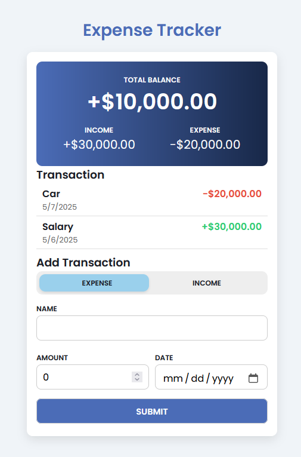

# 💰 EXPENSE TRACKER

## 📌 PROJECT TITLE

**EXPENSE TRACKER – TRACK AND MANAGE YOUR DAILY INCOME AND EXPENSES**

---

## 🎯 OBJECTIVE

The goal of this project is to build a **simple Expense Tracker** web application that helps users track their income and expenses. Users can input their transactions, and the app will calculate and display their total balance, income, and expenses dynamically.

---

## ⚙️ HOW IT WORKS

### 🧩 Features:

1. **Total Balance Calculation**  
   - The app calculates and displays the total balance by subtracting the total expenses from the total income.

2. **Income and Expense Tracking**  
   - Users can add transactions (either income or expense), with the app updating the income and expense totals accordingly.

3. **Transaction History**  
   - Users can see a list of all added transactions, including the name, type (income/expense), amount, and date.

4. **Add New Transactions**  
   - Users can input a new transaction through a form, including:
     - Transaction type (Income or Expense)
     - Name of the transaction
     - Amount

5. **Dynamic Updates**  
   - As users add transactions, the app updates the total balance, income, and expense values in real-time.

---

## 🖼️ SCREENSHOTS
